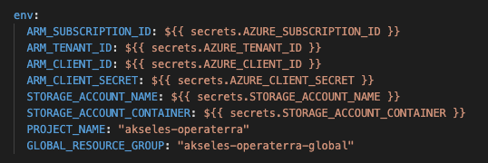
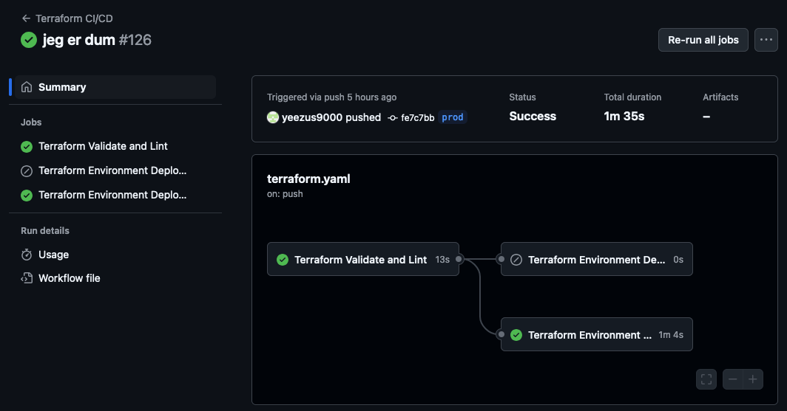
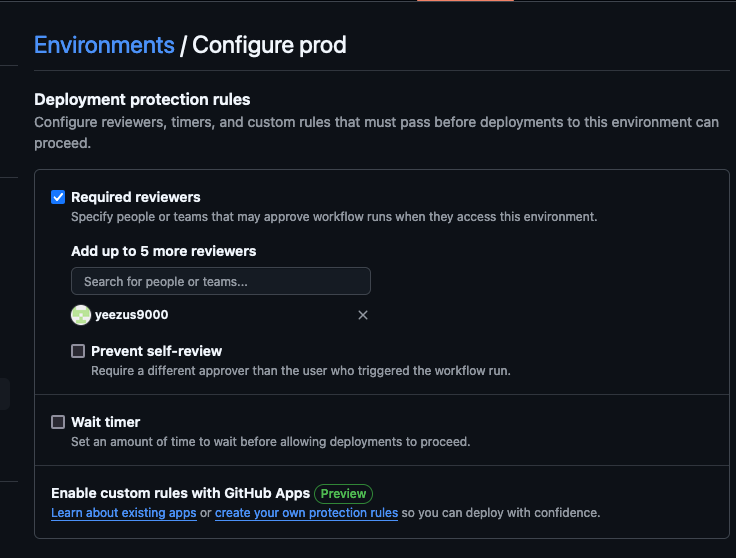
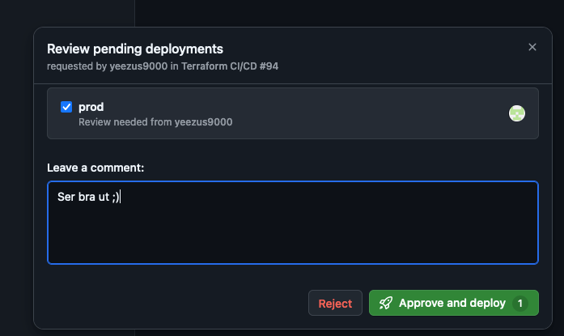

# iac_operaterra

Det som trengs:

* En resource group for state storage account. Denne må hete `${project_name}-global"`
  * For å få denne koden til å funke med github actions må den hete `akseles-operaterra-global` eller så må man oppdatere terraform.yaml filen der dette er hardkodet inn (sorry)
    
* En vilkårlig navngitt state storage account, med en vilkårlig navngitt container, og begge disse lagret som secrets i github
* Diverse secrets, se skjermbilde:
    

Forklaring:

* /.github/workflows/terraform.yaml er CI/CD workflowen som trigger på push/pull/merge, og leser hvilken branch man sitter i og lager riktige variabler for å deploye riktig. Dette lagres som en state i en uavhengig resource group i Azure, så det vil være consistent videre hvilke ressurser som allerede er opprettet.
<!-- Memo til meg selv: rydd opp i den filen den ser bomba ut og mangler funksjonaliteten vi slettet for mange timer siden -->
* Workflowen kjører /global/main.tf, som

